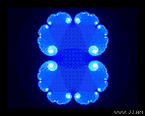

# Animated fractal generator

## Goal

Recreate example [Cardioid-sequence-fractal.gif](https://www.dropbox.com/s/e1zqzyxn6cz9wm4/Cardioid-sequence-fractal.gif?dl=0)

## Ideas

- use kotlin
- learn Rust and compare
- make simple desktop ui with Compose

## Refs

- [some yt render](https://www.youtube.com/watch?v=Ts9nmq41Amg)
- [rust learning 1](https://serokell.io/blog/learn-rust)
- [rust learning 2](https://www.rust-lang.org/learn)
